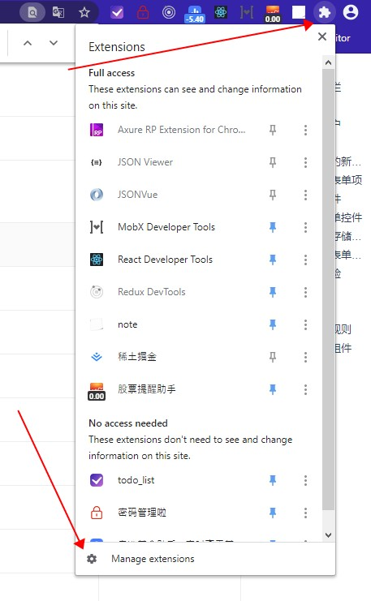
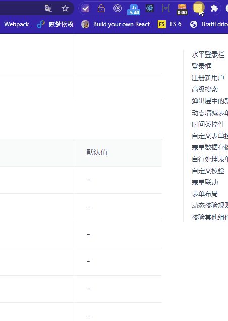

# note_write
## 记事本
当我们在网页中看到一些很重要的内容时，需要及时的记录下来，那么你就可能需要用到这款浏览器插件
步骤:
```
yarn build
```

然后将该文件夹拖到chrome插件页面
## 操作指南
添加新的篇目：Alt + a</br>
为该篇目添加文章：Alt + w</br>
编辑：双击要编辑的文章</br>
导航栏识别：<b>（默认以h3及粗体字为导航）</b>

